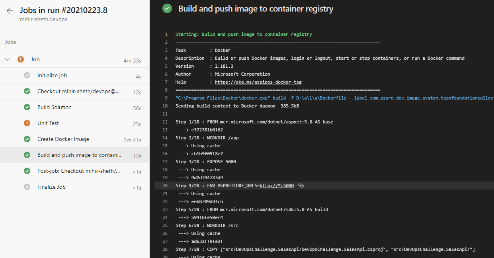

# DevOps Challenge (.NET)

## Introduction :wave:

The Devops Challenge covers the aspect to build & pack the .NET 5 application as a container in a CI/CD pipeline ready for deployment.

## Build Pipeline

- Using Windows 2019, the solution will be built, on success it will do unit testing. Please Note, at the moment, one of the unit test is failing hence I have "True" for continue on failure. As a practice I would have this unit test/code fixed before going to next stage, for this demo purpose, we will go ahead.

- On Powershell task, we will build the docker image using powershell script, the name of this docker image is stored in variable on azure-pipeline.yml. Please note, this task is kind of not needed as for the next task we will be building it again and use from cache, but I just thought to demonstrate use of powershell here.

- On Docker Build and Push task, it will use the conainer imgage generated from powershell task, using variables.yml it will get the service connection name, the service connection is of Docker Registry type, and push it to ACR so different environment such SIT, PreProd, Production can pull the container from the ACR repo.

## Release Pipeline

- Once the container is ready, its time to deploy to various enviroments (to App Services or any other relevant cloud offerings we would like to use). Each stage would have approval to ensure it gets approved first and then get deployed.

## TO DO

- Introduce Code Coverage using Coverlet tool or something similar and publish it to pipeline.
- Introduce code quality analysis tool like SonarQube.
